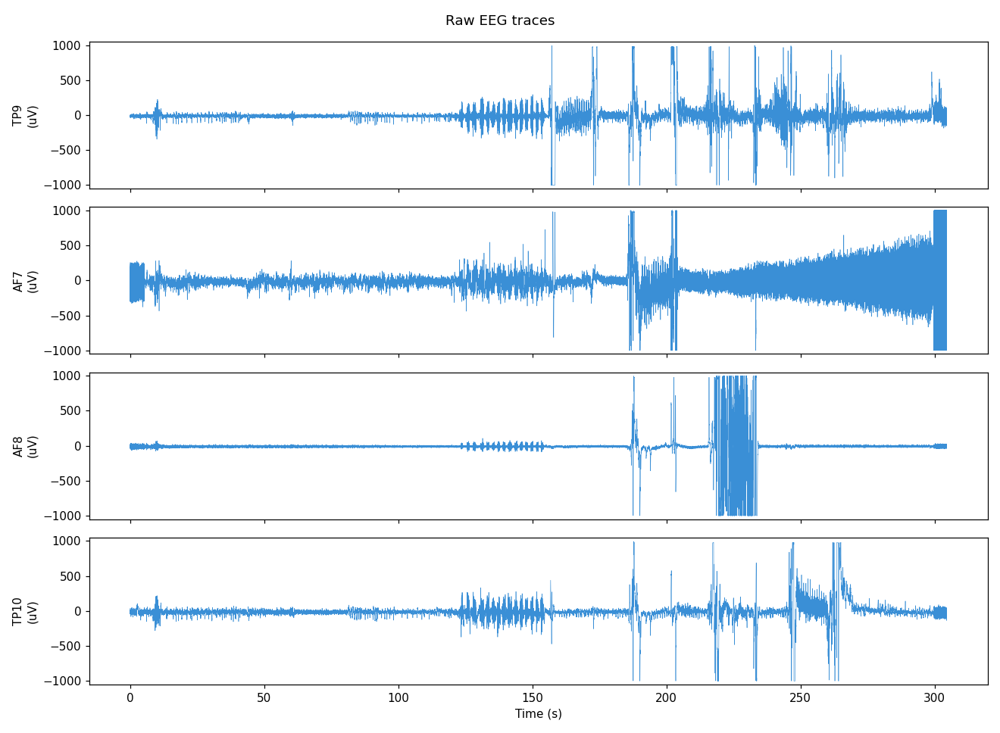
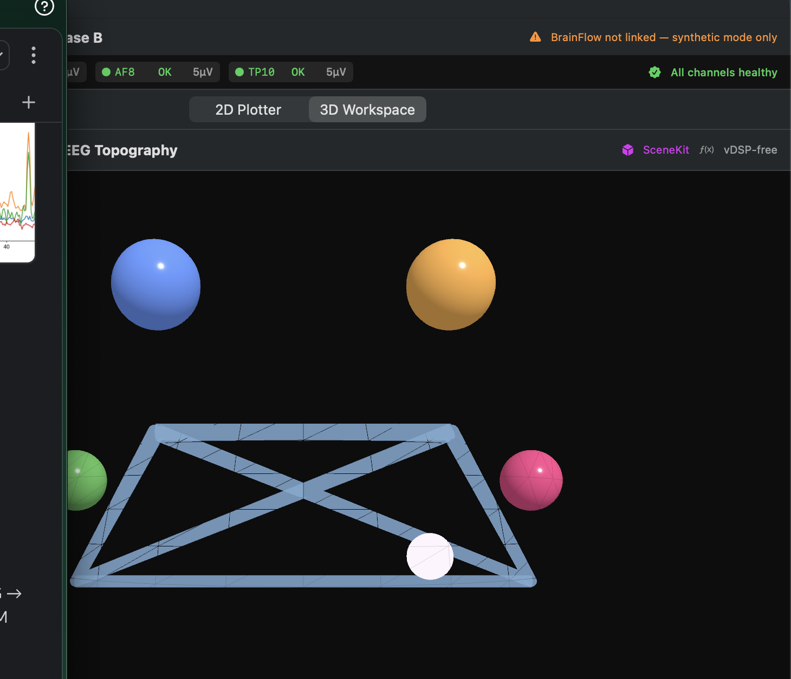

# NeuralCompose

A privacy-first, fully on-device macOS prototype for **EEG-driven communication**
and **sleep-cycle research**. A Muse headband streams brain signals through
BrainFlow, a Core ML classifier on the Apple Neural Engine detects intent
(jaw clench / blink / rest / select), and a local MLX LLM suggests the next
word. **No cloud APIs. No telemetry. No network at runtime.**

## Live signal

<p align="center">
  
  
</p>

Left: `EEGScalpPlotterView`, the 2D depth-stacked plotter, replaying the
project's first **golden recording** — TP9/AF7/AF8/TP10 live from a Muse S.
Right: `NeuralWorkspaceView`, the same session in 3D — node brightness tracks
broadband RMS, elevation tracks theta-band power, edge tint and pulse track
the live intent classifier's output.

| Channel | Contact | Clipping | RMS | Overall |
|---|---|---|---|---|
| TP9 | Excellent | 0.65% | 162.5 µV | Good |
| AF7 | Excellent | 0.85% | 176.6 µV | Good |
| AF8 | Excellent | 0.94% | 175.7 µV | Good |
| TP10 | Excellent | 0.34% | 146.4 µV | Good |

98 blink-like transients and 19 EMG bursts detected across the narrated
protocol (eyes open/closed, blinks, jaw clenches, and a deliberate
electrode-lift on each channel in turn). Full report — [PSD](Recordings/golden/report/psd.png),
[spectrogram](Recordings/golden/report/spectrogram.png),
[rolling band power](Recordings/golden/report/band_power.png),
[RMS timeline](Recordings/golden/report/rms_timeline.png) — and the raw
recording's provenance: [`Recordings/golden/README.md`](Recordings/golden/README.md).

This recording also backs `Tests/BCIEEGTests/GoldenRecordingRegressionTests.swift`:
every test run replays it deterministically (see [Playback & synchronization](#playback--synchronization-math)
below) through the real windowing → feature-extraction → classifier →
channel-health pipeline and checks the output against a committed reference.

> **On AF7:** an earlier validation session (`validate-muse-physiology.py`)
> found AF7 saturated (~900 µV RMS) across 4 consecutive runs and read that
> as a hardware defect. It wasn't — headband tautness was the actual cause;
> once corrected, AF7 recorded as cleanly as the other three channels. Worth
> remembering before writing off a "bad" channel as broken hardware.

## Project status (July 2026)

| Status | Component |
|--------|-----------|
| ✅ | Native BrainFlow integration (BLE + BCIBridge) |
| ✅ | Live Muse S acquisition (256 Hz, 4 channels) |
| ✅ | Communication mode (intent → carousel → MLX LLM) |
| ✅ | Phase B Sleep Validation Toolkit — 2D plotter + 3D live topography |
| ✅ | Deterministic playback (`PlaybackEEGStream.normalized`) + CI regression against a golden recording |
| ✅ | 3D workspace driven entirely by live classifier output (no manual controls) |
| ✅ | Semantic embedding backend — `SentenceEmbedder` seam, golden replay, `EmbeddingBench` harness, and a real Core ML conversion of BGE-small-en-v1.5 (the CoreML-converted backend; the frozen Stage 3.4 leaderboard ranks all-MiniLM-L6-v2 #1 overall) |
| ✅ | Stage 3.4 offline interaction science — complete and frozen: 17/17 embedding + 18/18 generation candidates terminal, RQ1 runtime equivalence confirmed (4/4 cross-runtime comparisons, cosine 1.000000), evidence checksummed under `Evaluation/stage_3_4/frozen/` — see `Evaluation/reports/STAGE_3_4_EXIT_REPORT.md` |
| 🧪 | Stage 3.5 pipeline engineering (routing/cascades/policies) — pre-registered in `hypothesis_registry.json`, not started |
| 🚧 | Sleep-stage classifier (4-class: Wake / N1 / N2_N3 / Uncertain_REM) |
| 🚧 | Dream-session controller + session FSM |
| 🚧 | LLM primer generation + dream-report analogy extraction |
| 🧪 | Cognitive-incubation experiments (pre-registration pending) |

## Architecture

```
                    ┌──────────────────────────────────────────────────────┐
                    │                NeuralComposeApp                       │
                    │  (SwiftUI: comms window, Phase B debug, menu-bar UI)  │
                    └─────┬──────────────────────────┬──────────────────────┘
                          │                          │ Cmd+Shift+D
                          ▼                          ▼
                ┌──────────────────┐        ┌─────────────────────────┐
                │ TextComposition  │        │  SleepValidationView    │
                │ Controller       │        │  (2D plotter, 3D scene) │
                └────────┬─────────┘        └─────────────────────────┘
                         ▼
                ┌──────────────────┐    ┌──────────────────┐
                │ IntentSmoother   │    │ EEGWindowing     │  (2s comms / 30s sleep)
                │ (BCICore actor)  │    │ (BCICore actor)  │
                └────────┬─────────┘    └────────┬─────────┘
                         ▼                       │
                ┌──────────────────┐             │
                │ Core ML on ANE   │◄────────────┘
                │ (BCIClassifier)  │
                └────────┬─────────┘
                         ▼
                ┌──────────────────┐
                │ EEGStreaming     │ ← BrainFlow / synthetic / playback
                │  (BCIEEG)        │
                └──────────────────┘
```

**Module boundaries** (MLX isolation is load-bearing):

- `BCICore` — pure-Swift models, protocols, FSMs, buffers. **No third-party deps.**
- `BCIBridge` — Obj-C++ shim for BrainFlow (stub by default, gated by `BCI_BRAINFLOW_AVAILABLE`).
- `BCIEEG` — `BrainFlowService`, `SyntheticEEGStream`, `PlaybackEEGStream`, `EEGScalpPlotterView`, `NeuralWorkspaceView`.
- `BCIClassifier` — Core ML wrapper + deterministic mock (also the CI classifier); also hosts `CoreMLSentenceEmbedder` + `WordPieceTokenizer` for real semantic embeddings.
- `BCILLM` — **MLX-Swift linked only here.** Adapter + stub + tokenizer.
- `NeuralComposeApp` — SwiftUI views, Phase B debug window, menu-bar UI.
- `EmbeddingBench` — sibling executable (not part of the app) that benchmarks any `SentenceEmbedder` conformer; knows nothing about Core ML or MLX.

The app talks to `BCILLM` through `NextWordPredicting`, so there's exactly
**one** MLX runtime copy in the linked binary.

Related architecture notes:

- [Three Orthogonal Concerns](docs/architecture/three-orthogonal-concerns.md)
  separates Science, Engineering, and Computation.
- [Engineering Runtime](docs/architecture/engineering-runtime.md)
  scopes bounded implementation backends.
- [Julia Science Workspace](docs/architecture/julia-science-workspace.md)
  keeps Julia as an offline scientific laboratory, not an app runtime.
- [EEG Mathematics, Physics, and Methods Scope](docs/scoping/eeg-mathematics-physics-methods-scope.md)
  keeps the current encoder work grounded in the necessary linear-algebra,
  signal-processing, and evaluation foundations while deferring forward models
  and policy/control theory to later falsifiable experiments.
- [State Reconstruction Goal 0](docs/science/state-reconstruction-goal-0.md)
  and [Trajectory Analysis Goal 1](docs/science/trajectory-analysis-goal-1.md)
  turn soak telemetry into falsifiable science artifacts.
- [Sobolev and ZPD Hypotheses](docs/science/sobolev-zpd-hypotheses.md)
  places smooth dynamics and proximal intervention as falsifiable research claims.
- [Symbolic Systems as Hypothesis Sources](docs/science/symbolic-systems-hypothesis-sources.md)
  keeps traditions like geomancy as testable abstractions, not runtime modes.
- [Semantic-to-Prosody Boundary](docs/architecture/semantic-to-prosody-boundary.md)
  separates what text is generated from how it is spoken.
- [Prosody Feature Contract](docs/architecture/prosody-feature-contract.md)
  defines the cadence fields that Engineering can measure and Science can model.

### Rust Phase 0

`Rust/prosody_features` is the first deterministic measurement crate.
It is not wired into the Swift runtime. It measures mono audio into
prosody features that can later feed telemetry contracts:

```bash
cd Rust/prosody_features
cargo test
```

### Four-layer model

The codebase is organized into four layers, named for *role* (not
current contents) so they remain meaningful as the platform grows:

```
┌─────────────────────────────────────────────────────┐
│                      Interface                      │
│  SwiftUI · SceneKit · Plotters · Channel-health UI  │
└────────────────────────▲────────────────────────────┘
                         │ depends on
┌────────────────────────┴────────────────────────────┐
│                     Intelligence                    │
│  DSP · Features · Classifier · Embeddings · Project │
└────────────────────────▲────────────────────────────┘
                         │ depends on
┌────────────────────────┴────────────────────────────┐
│                      Runtime                        │
│  EEGStreaming · AsyncMulticastChannel · Supervisors │
│  Recording · Diagnostics                            │
└────────────────────────▲────────────────────────────┘
                         │ depends on
┌────────────────────────┴────────────────────────────┐
│                  External Systems                   │
│   Muse · BrainFlow · OSC · Playback · Synthetic     │
└─────────────────────────────────────────────────────┘

  ▼ data flows downward
```

**External Systems** is whatever produces samples — the Muse over
BrainFlow, a remote Muse over OSC, a recorded file in playback, a
deterministic synthetic stream. The layer is named "External" rather
than "Hardware" because playback and synthetic are not hardware; the
shared property is "outside the process boundary of the analysis
pipeline."

**Runtime** owns the streaming substrate: the single-owner
`EEGStreaming` (see ADR-001), the `AsyncMulticastChannel` that
distributes samples to multiple consumers, the supervisors that handle
stalls and reconnects, the recording subsystem, and the transport
diagnostics.

**Intelligence** is the analysis layer: feature extraction, the
intent classifier, the sentence embedder (`SentenceEmbedder` protocol —
`DeterministicSentenceEmbedder` stub by default, `CoreMLSentenceEmbedder`
when a converted model is present under `Models/`), and the projection
that turns a high-dimensional embedding into a 3D point. It does not
know what produced the samples or what will render the output.

**Interface** is everything the user sees: SwiftUI windows, the
SceneKit 3D workspace, the 2D plotter, the privacy indicator, the
channel-health badge. It consumes Intelligence outputs and never
imports Core ML or MLX directly.

The dependency direction is strictly downward: Interface depends on
Intelligence, Intelligence depends on Runtime, Runtime depends on
External Systems. A component that needs to know about a
non-adjacent layer is a sign that either the data flow should be
redesigned, or the missing protocol should be added at the layer
boundary where the knowledge should live.

See [`docs/architecture/PRINCIPLES.md`](docs/architecture/PRINCIPLES.md)
for the engineering values these layers implement, and
[`docs/architecture/decision-log/`](docs/architecture/decision-log/)
for the specific architectural decisions recorded under those
principles.

## Playback & synchronization math

Live acquisition is a noisy clock — inter-sample gaps jitter with radio
conditions and OS scheduling (over BLE), or with network latency (a remote
Muse streamed over OSC), so recorded timestamps never land on a perfect grid.
`PlaybackEEGStream.normalized` resamples a recording onto an
exact uniform grid before replay, via linear interpolation between the
two nearest recorded samples $(t_a, x_a)$, $(t_b, x_b)$:

$$x(t) = x_a + (x_b - x_a)\cdot\frac{t - t_a}{t_b - t_a}, \qquad t_a \le t \le t_b$$

Two replays of the same file at the same target rate then produce
byte-identical sample sequences, independent of the original jitter — the
property the CI regression test depends on.

Classifier confidence driving the 3D workspace's edge pulse is
EMA-smoothed so an async prediction arrival doesn't visibly pop:

$$\hat{c}_n = \hat{c}_{n-1} + \alpha\,(c_n - \hat{c}_{n-1}), \qquad \alpha = 0.15$$

and node brightness is broadband RMS under a log compression so small
changes stay visible without large ones saturating:

$$I = \mathrm{clamp}\bigl(\log(1 + 0.05\cdot\mathrm{RMS}),\;0,\;1\bigr)$$

Predictions and samples arrive on independent streams; if a prediction goes
stale (no update for `classifierStaleThreshold` while samples keep
flowing), intent-driven color/pulse dim rather than keep showing a
confidently-colored but outdated classification.

**Measured performance** (Apple Silicon, debug build): replaying the golden
recording (77,966 samples / 305s) through the full windowing → features →
classifier → channel-health → 3D-scene-checkpoint pipeline takes ~6.9s
wall-clock — about 44× faster than real time, consistent with `.instant`
pacing bypassing per-sample sleeps entirely. `NeuralWorkspaceView.recompute()`
(the per-frame node/edge material update) costs ~0.42ms/call — at the
view's 30Hz target refresh, that's ~1.3% of the frame budget, leaving
headroom for a future embedding-projection node without a redesign.

## Scientific motivation

This is a platform, not a clinical or productivity tool. The aim is to build
the on-device infrastructure that lets a small research team:

1. Validate consumer-grade EEG against physiological expectations (alpha
   rise on eyes-closed, blink transients, jaw-clench EMG contamination).
2. Estimate sleep stage from 4 frontal channels (Muse S: TP9, AF7, AF8,
   TP10 — no chin EMG, no EOG). A 4-class output is the honest upper bound.
3. Test whether TMR cues during N2/SWS paired with LLM-generated dream
   analysis improve creative problem solving — pre-registration required
   before claiming any effect.
4. Ship the platform regardless of (3): the validation toolkit and codebase
   are useful contributions on their own.

Established neuroscience (alpha dropout, AASM staging, TMR for declarative
memory) is treated as established. Novel claims (LLM analogy extraction,
insight improvement) are treated as unproven. Every claim in
`SLEEP_CYCLE_DESIGN.md` carries a confidence rating.

**Core signal-processing definitions** (full derivations in [`docs/Math.md`](docs/Math.md)):

### EEG Representation

$$
\mathbf{X}(t) =
\begin{bmatrix}
x_{\mathrm{TP9}}(t)\\
x_{\mathrm{AF7}}(t)\\
x_{\mathrm{AF8}}(t)\\
x_{\mathrm{TP10}}(t)
\end{bmatrix}
\in \mathbb{R}^{4 \times N}
$$

### Band Power

$$
P_b = \int_{f_1}^{f_2} \hat{S}_{xx}(f)\,df \approx \sum_i \hat{S}_{xx}(f_i)\,\Delta f
$$

### Alpha Dropout

$$
r_\alpha = \frac{P_\alpha^{\mathrm{baseline}}}{P_\alpha}
$$

### Embedding Similarity

For unit-normalized embeddings,

$$
\cos(\hat{\mathbf{v}}_1, \hat{\mathbf{v}}_2) = \hat{\mathbf{v}}_1^\top \hat{\mathbf{v}}_2
$$

### Joint Embeddings

The equation

[
\mathbf{z} =
\frac{\operatorname{concat}(w_i,\mathbf{v}_i)}
{\left|\operatorname{concat}(w_i,\mathbf{v}_i)\right|_2}
]

means:

1. Multiply each embedding vector (\mathbf{v}_i) by its scalar weight (w_i).
2. Concatenate the weighted vectors into one long vector.
3. Compute its L2 norm.
4. Normalize the concatenated vector to unit length.

Assuming:

* `weights = [w1, w2, ...]`
* `vectors = [[...], [...], ...]`
* all vectors are floating point arrays

---

# Swift

```swift
func jointEmbedding(
    weights: [Float],
    vectors: [[Float]]
) -> [Float] {
    precondition(weights.count == vectors.count)

    var concatenated: [Float] = []

    for (w, v) in zip(weights, vectors) {
        concatenated.append(contentsOf: v.map { $0 * w })
    }

    let norm = sqrt(concatenated.reduce(0) { $0 + $1 * $1 })

    guard norm > 0 else {
        return concatenated
    }

    return concatenated.map { $0 / norm }
}
```

---

# C++

```cpp
#include <vector>
#include <cmath>

std::vector<float> jointEmbedding(
    const std::vector<float>& weights,
    const std::vector<std::vector<float>>& vectors)
{
    std::vector<float> z;

    for (size_t i = 0; i < vectors.size(); ++i)
        for (float x : vectors[i])
            z.push_back(weights[i] * x);

    float norm = 0.f;
    for (float x : z)
        norm += x * x;

    norm = std::sqrt(norm);

    if (norm > 0.f)
        for (float& x : z)
            x /= norm;

    return z;
}
```

---

# C

```c
#include <math.h>
#include <stddef.h>

void joint_embedding(
    const float *weights,
    const float *vectors[],
    const size_t lengths[],
    size_t n_vectors,
    float *output)
{
    size_t idx = 0;

    for (size_t i = 0; i < n_vectors; ++i)
        for (size_t j = 0; j < lengths[i]; ++j)
            output[idx++] = weights[i] * vectors[i][j];

    float norm = 0.0f;

    for (size_t i = 0; i < idx; ++i)
        norm += output[i] * output[i];

    norm = sqrtf(norm);

    if (norm > 0.0f)
        for (size_t i = 0; i < idx; ++i)
            output[i] /= norm;
}
```

---

# Python (NumPy)

```python
import numpy as np

def joint_embedding(weights, vectors):
    weighted = [
        w * np.asarray(v, dtype=float)
        for w, v in zip(weights, vectors)
    ]

    z = np.concatenate(weighted)

    norm = np.linalg.norm(z)

    if norm > 0:
        z /= norm

    return z
```

---

# Julia

```julia
using LinearAlgebra

function joint_embedding(weights, vectors)
    weighted = [
        w .* v
        for (w, v) in zip(weights, vectors)
    ]

    z = vcat(weighted...)

    n = norm(z)

    n == 0 && return z

    return z ./ n
end
```

---

# Rust

```rust
pub fn joint_embedding(
    weights: &[f32],
    vectors: &[Vec<f32>],
) -> Vec<f32> {
    assert_eq!(weights.len(), vectors.len());

    let mut z = Vec::new();

    for (w, v) in weights.iter().zip(vectors.iter()) {
        for x in v {
            z.push(w * x);
        }
    }

    let norm = z
        .iter()
        .map(|x| x * x)
        .sum::<f32>()
        .sqrt();

    if norm > 0.0 {
        for x in &mut z {
            *x /= norm;
        }
    }

    z
}
```

---

## Mathematical pseudocode

All six implementations perform the same computation:

```text
z = []

for each embedding i:
    z.append(weight_i * embedding_i)

norm = sqrt(sum(z²))

if norm > 0:
    z = z / norm

return z
```

This formulation is directly applicable to your `SentenceEmbedder` abstraction in NeuralCompose. It also generalizes naturally to combining embeddings from multiple backends (e.g., BGE, E5, MiniLM, or future models) into a single normalized joint embedding while preserving cosine similarity semantics.


### Decoder Stability

$$
D = \max_n r_n
$$

where $r_n$ is the repeat count for period $n$. Decoder stability
additionally records loop period and repeat count.

For complete derivations and notation, see [`docs/Math.md`](docs/Math.md) —
including §11, the cross-project measurement primitives ($(\mathrm{PR}, \alpha)$
eigenspectrum descriptors, aperiodic-adjusted spectral features via specparam,
and the trajectory-novelty functional $N_{\mathrm{PR}}$) that tie the awake
pipeline, the WorldModel JEPA spike, and the sleep study to one shared set of
instruments — and its companion upgrades in [`docs/Research.md`](docs/Research.md).

## Repository layout

```
NeuralCompose/
├── Sources/
│   ├── BCIBridge/        Obj-C++ shim for BrainFlow (stub by default)
│   ├── BCICore/          pure-Swift models, protocols, FSMs, buffers
│   ├── BCIEEG/           EEG streams, 2D plotter, 3D workspace (Phase B)
│   ├── BCIClassifier/    Core ML wrapper + deterministic mock; CoreMLSentenceEmbedder
│   ├── BCILLM/           MLX adapter + stub + tokenizer  ← only MLX target
│   ├── NeuralComposeApp/ SwiftUI views, Phase B debug window
│   └── EmbeddingBench/   benchmarks any SentenceEmbedder conformer (sibling executable)
├── Tests/                unit + golden-recording + semantic-replay regression tests
├── Scripts/
│   ├── build.sh / run-synthetic.sh / run-muse-s.sh
│   ├── record-golden.sh              # capture a new golden reference recording
│   ├── analyze-eeg-session.py        # PSD/band-power/spectrogram/quality report for any recording
│   ├── validate-muse-physiology.py   # live 5-condition acquisition sanity check
│   └── convert-sentence-embedder.py  # HF sentence-embedding model -> Core ML (BGE/E5/MiniLM)
├── Recordings/           per-session EEG (gitignored) + golden/ (committed reference + report)
├── Benchmarks/           dated per-backend embedding benchmark JSON — historical record, never overwritten
├── docs/                 long-form documentation
├── SLEEP_CYCLE_DESIGN.md full D1–D8 sleep architecture spec
└── HARDWARE_SETUP.md / MODEL_SETUP.md / CALIBRATION.md / TROUBLESHOOTING.md
```

## Quick start

**Synthetic mode — no hardware, no models:**

```bash
git clone https://github.com/aurascoper/NeuralCompose.git
cd NeuralCompose
./Scripts/build.sh
./Scripts/run-synthetic.sh
```

**Live Muse S** (after BrainFlow is installed at `~/Developer/brainflow/`):

```bash
./Scripts/build.sh --with-brainflow
./Scripts/run-muse-s.sh
```

**Phase B debug window** (`Cmd+Shift+D` in the running app) — live
`EEGScalpPlotterView` (2D) and `NeuralWorkspaceView` (3D) tabs.

**Replay the golden recording:**

```bash
python3 Scripts/analyze-eeg-session.py Recordings/golden/golden_20260710-141352.eeg.csv
swift test --filter GoldenRecordingRegressionTests
```

## Experimental status & limitations

| Claim | Status |
|-------|--------|
| Live Muse S EEG acquisition through BrainFlow is reproducible on macOS | **Established** |
| Per-channel RMS, alpha power, and blink detection are observable on consumer Muse hardware | **Established** |
| Deterministic playback + CI regression against real hardware data | **Established** |
| 4-class sleep staging from Muse S is achievable at research accuracy | **Plausible** — domain shift from PSG is the largest expected error source |
| TMR cues + LLM dream analysis improves engineering insight | **Unproven** — the D8 pilot evaluation study (§14 crossover), pre-registration pending |
| 5-class AASM sleep staging on Muse S | **Hardware-limited** — no chin EMG, atonia is the defining REM criterion |

The platform ships regardless of the unproven claims — the validation
toolkit, architectural spec, and codebase are useful on their own.

## Documentation

- [`Recordings/golden/README.md`](Recordings/golden/README.md) — golden recording provenance, full report, plots.
- [`HARDWARE_SETUP.md`](HARDWARE_SETUP.md) · [`MODEL_SETUP.md`](MODEL_SETUP.md) · [`CALIBRATION.md`](CALIBRATION.md) · [`TROUBLESHOOTING.md`](TROUBLESHOOTING.md)
- [`SLEEP_CYCLE_DESIGN.md`](SLEEP_CYCLE_DESIGN.md) — full D1–D8 sleep architecture spec.
- [`docs/Architecture.md`](docs/Architecture.md) · [`docs/Math.md`](docs/Math.md) · [`docs/Validation.md`](docs/Validation.md) · [`docs/Research.md`](docs/Research.md)
- [`docs/architecture/embedding_contract.md`](docs/architecture/embedding_contract.md) — the `SentenceEmbedder` backend contract every conformer (stub, Core ML, future MLX) must satisfy; ratified by [ADR-004](docs/architecture/decision-log/ADR-004-sentence-embedder-backend-contract.md).

## Citation

A paper draft is in `paper/`. Suggested citation when published:

> Kinder, H. (2026). *An open-source, privacy-preserving platform for EEG-guided
> cognitive incubation and dream-report analysis using consumer-grade
> hardware.* In preparation.

## License

Research prototype code. **Do not use NeuralCompose to make clinical or
safety-critical decisions.** License terms: see [`LICENSE`](LICENSE) (MIT).

## Acknowledgements

- **BrainFlow** for the unified biosensor acquisition API.
- **MLX-Swift** for the local on-device LLM runtime.
- **Apple Neural Engine** for low-power Core ML inference.
- The Muse headband community for open BLE protocol documentation.
- The sleep-staging research community for the AASM standard.
