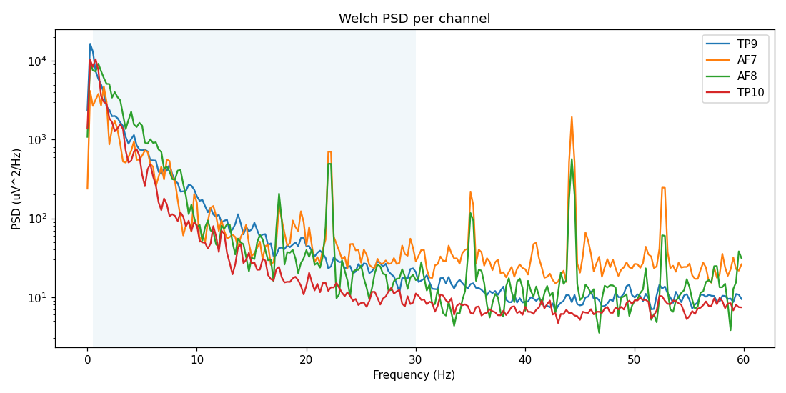
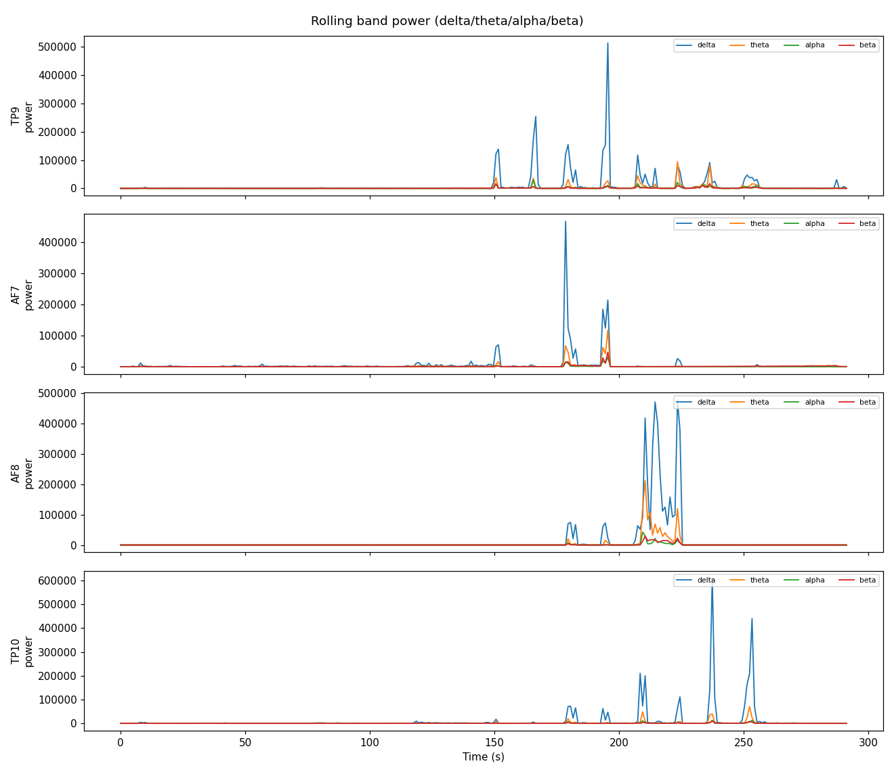
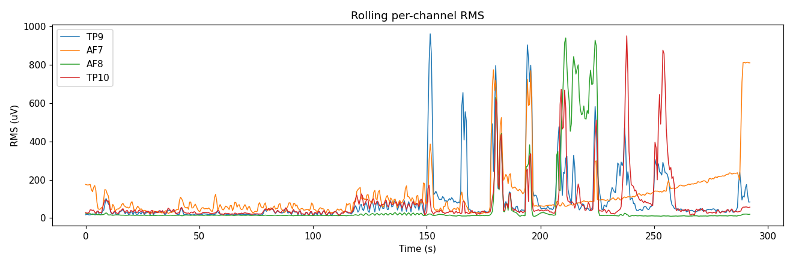
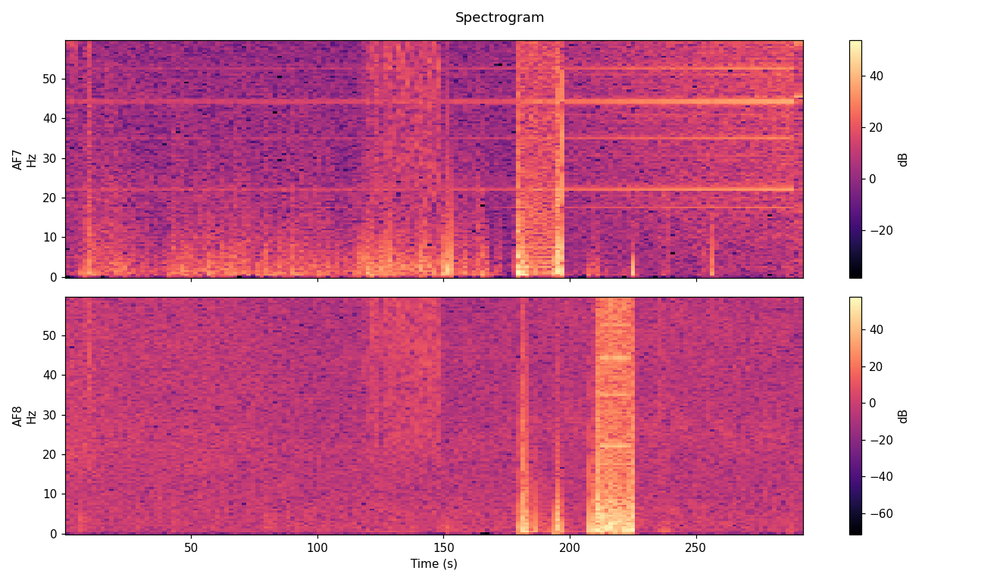

# Golden recording — golden_20260710-141352

status: golden (first validated reference recording)

source: ~/Documents/NeuralCompose/Recordings/calibration_2026-07-10T141352_muses/
full interactive report: [report/report.html](report/report.html) (generated by
`Scripts/analyze-eeg-session.py`; graphs below are the same report's plots,
embedded for viewing without cloning + opening HTML)
recorded: 2026-07-10, live Muse S, expanded per-channel-lift protocol
(~305s @ ~256Hz, 4ch: TP9/AF7/AF8/TP10)

Raw EEG (the `.eeg.csv`/`.labels.csv`/`.events.csv`/`.metadata.json` files
next to this README) is **not** committed — this project is privacy-first
and that data never leaves the machine it was recorded on (see
`Scripts/record-golden.sh`'s own note on this). Only this README and the
derived report/plots below are checked in.

## Why this one

Preceded by 5 earlier attempts (all marked silver, see
Recordings/validation/2026-07-10/) working through two separate real issues:

1. AF7 contact was persistently poor (37-42% clipping) across most attempts
   despite reseating — eventually resolved by fixing headband tautness.
2. A real app bug: the BLE session can silently die mid-session without the
   retry/reconnect logic detecting it, leaving the channel-health UI frozen
   on stale "saturated" values indistinguishable on-screen from genuine live
   saturation. Several "still bad" readings during troubleshooting were this,
   not actual contact problems. Not yet fixed in code — see note below.

## Quality (via analyze-eeg-session.py)

| Channel | Contact | Clipping | RMS | Overall |
|---|---|---|---|---|
| TP9 | Excellent | 0.65% | 162.5uV | Good |
| AF7 | Excellent | 0.85% | 176.6uV | Good |
| AF8 | Excellent | 0.94% | 175.7uV | Good |
| TP10 | Excellent | 0.34% | 146.4uV | Good |

98 blink-like events, 19 EMG bursts detected (protocol included blinks_20,
jaw_clenches_10, and individual TP9/AF7/AF8/TP10 lift segments — see
Scripts/record-golden.sh for the exact narrated protocol).

## Graphs

**Raw traces** — all 4 channels, full ~305s duration:


**Power spectral density** per channel (Welch):



**Rolling band power** (delta/theta/alpha/beta), one row per channel:



**RMS timeline** per channel:



**Spectrogram** (AF7/AF8):



## Used by CI

This recording is the input to `Tests/BCIEEGTests/GoldenRecordingRegressionTests.swift`
(Phase 1 of the deterministic-playback work): `PlaybackEEGStream` resamples
it onto an exact 256.000 Hz grid (`PlaybackTiming.normalized`), then the
real windowing -> feature-extraction -> classifier -> channel-health
pipeline runs against it and is compared to the committed
`Tests/BCIEEGTests/Fixtures/reference_pipeline.json` on every test run. The
raw CSV is required locally for that test to run (it's gitignored, per
above) — the test skips gracefully if it's absent, e.g. on a fresh clone or
in a CI environment that hasn't been given the fixture deliberately.

## Known follow-up (not yet done)

The silent-BLE-disconnect bug above is real and worth fixing: AppViewModel's
live-stream retry/backoff (see `Live stream interrupted` logging) appears to
only trigger on *initial* connection failure, not on a mid-session drop of an
already-started BrainFlow stream. The channel-health UI has no way to
indicate "stale" vs "currently live" — worth adding a staleness indicator
(e.g. grey out badges if no sample received in N seconds) rather than only
fixing the reconnect logic.

## Usage

```bash
./Scripts/run-synthetic.sh --profile playback --recording "Recordings/golden/golden_20260710-141352.eeg.csv"
```

Or analyze directly:

```bash
python3 Scripts/analyze-eeg-session.py Recordings/golden/golden_20260710-141352.eeg.csv
```
